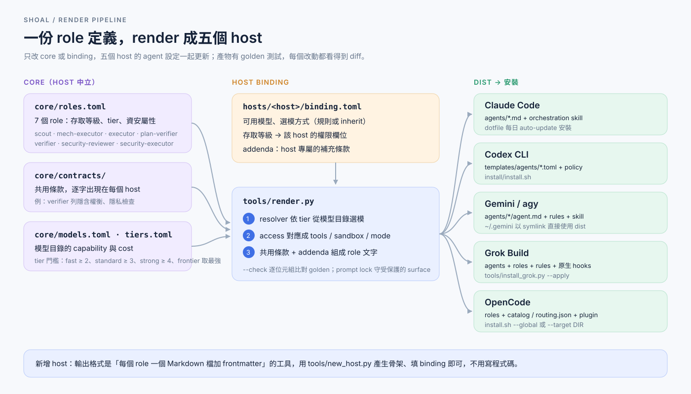
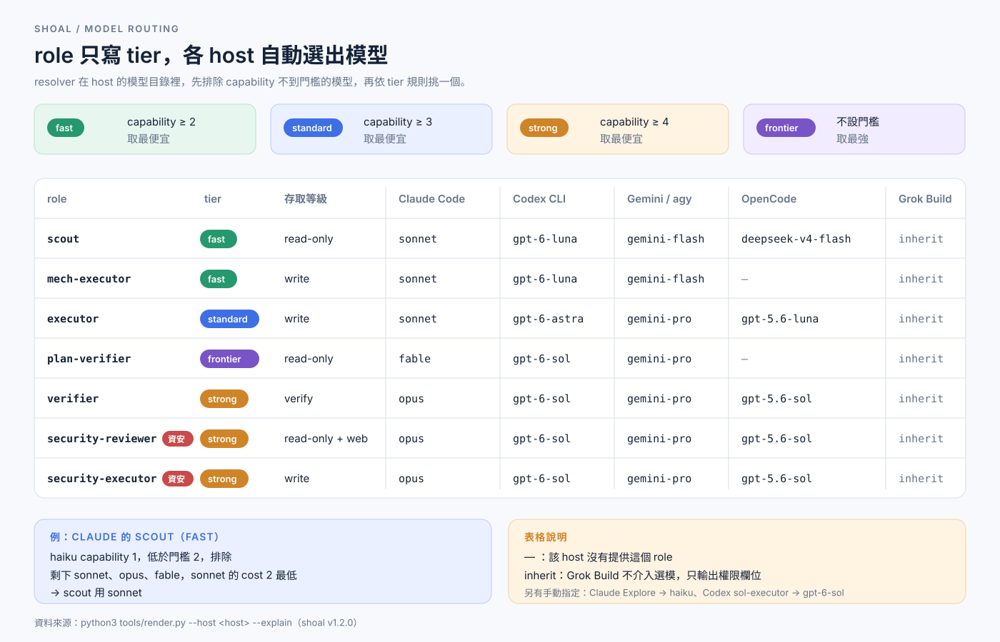
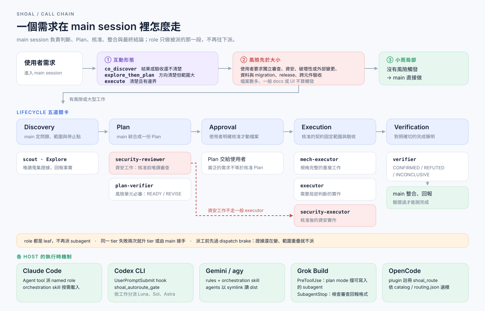

# shoal

一份 host 中立的 role catalog，render 成 5 個 host 的 agent 設定：
Claude Code、Codex CLI、Gemini/agy、Grok Build、OpenCode。

shoal 只維護一份 role 定義（`scout`、`executor`、`verifier` 等）。每個 host
用自己的 binding 決定 model、effort，並把 role 的存取等級對應成該 host 的權限欄位，再由 renderer 產生該 host
要安裝的檔案。產物有 golden 測試，改動一律看得到 diff。



## 選模

role 只寫 tier，不寫模型。resolver 在每個 host 的模型目錄裡排除 capability
不到門檻的模型，再依 tier 規則挑一個；grok 設為 `inherit`，沿用 grok 自己的
選模。用 `python3 tools/render.py --host <host> --explain` 可以看到每個 role
的候選、排除原因與結果。



## 呼叫鏈

main session 先判斷互動形態與風險，小而局部的工作直接做；有風險或大型工作
才走五道關卡，依階段派唯讀、審查或寫入的 role。完整規則在各 host 的
orchestration policy（例如
`hosts/claude/dist/skills/shoal-orchestration/references/orchestration-policy.md`）。



## 目錄結構

```text
core/roles.toml            host 中立的 role 定義
hosts/<host>/binding.toml  可用 model、access 對應的權限、effort
hosts/<host>/src/          該 host 的 policy 與 skill 原文
hosts/<host>/dist/         render 產出，已 commit（codex 產出在 templates/）
claude-plugin/             Claude plugin，render 產出（--host claude-plugin），不手改
.claude-plugin/            Claude marketplace manifest，同上
tools/render.py            renderer 與 --check
tools/install_grok.py      由 committed HEAD 安裝 grok host（預設 dry-run）
tools/check_links.py       文件相對連結檢查
tests/golden/<host>/       各 host 的逐位元組基準
upstream.lock              各 host 對應的上游與版本
```

`hosts/codex/` 另含 `VERSION`、`README.md`、`CHANGELOG.md`，是 Codex host 自己
的文件。安裝腳本 `install/`、`INSTALL.md` 留在 repo 根目錄。

## render

```bash
# 檢查：dist 與 core、binding、src 是否一致，不一致 exit 1
python3 tools/render.py --host claude --check

# 寫入：重新產生該 host 的 dist
python3 tools/render.py --host claude --write
```

`--host` 可選 `claude`、`codex`、`agy`、`grok`、`opencode`，以及 binding 設
`renderer = "generic-md"` 的 host。另有 `--host claude-plugin`：產生 Claude plugin
（`claude-plugin/`、`.claude-plugin/marketplace.json`），不是第六個 host。
修改 core 或 binding 後先 `--write`，再跑
`python3 -m unittest discover -s tests` 確認 golden 差異是預期的。

## 新增 host

輸出格式是「每個 role 一個 Markdown 檔加 frontmatter」的工具，不用寫程式碼：
`python3 tools/new_host.py <name>` 產生骨架，填 `[models]` 與工具對應表後
`--write`。步驟見 [docs/new-host.md](./docs/new-host.md)。

## 安裝入口

| Host | 目前的安裝方式 |
| --- | --- |
| Codex CLI | [INSTALL.md](./INSTALL.md)，腳本在 `install/install.sh` |
| Claude Code | 取用 `hosts/claude/dist`，由 dotfile auto-update 安裝；dispatch guard：`python3 tools/install_hooks.py --host claude`（預設 dry-run，`--apply` 才寫入），見 [INSTALL.md](./INSTALL.md#claude-code-與-geminiagy-的-dispatch-guard) |
| Claude Code plugin | `claude plugin marketplace add miyago9267/shoal#v<版本>` 再 `claude plugin install shoal@shoal`（釘 tag；與全域 guard 同時存在時只判斷一次；state 與 log 在 `${XDG_STATE_HOME:-~/.local/state}/shoal/guard/`，uninstall 不刪），見 [INSTALL.md](./INSTALL.md#claude-code-plugin) |
| Gemini/agy | `hosts/agy/dist`，由 dotfile `setup_gemini.sh` 連結；dispatch guard：`python3 tools/install_hooks.py --host agy`，見 [INSTALL.md](./INSTALL.md#claude-code-與-geminiagy-的-dispatch-guard) |
| Grok Build | `python3 tools/install_grok.py`（預設 dry-run，`--apply` 才寫入），見 [INSTALL.md](./INSTALL.md#grok-build) |
| OpenCode | 專案：`hosts/opencode/plugin/install/install.sh --target DIR --enable`；全域：`install.sh --global --enable`，見 [INSTALL.md](./INSTALL.md#opencode) |

Claude Code、Gemini/agy 的 role 檔案安裝步驟仍依賴 dotfile 的腳本；Grok Build 由
`tools/install_grok.py` 安裝 agents、roles、rules 與原生 hooks，不再手動複製。
dispatch guard（`hooks/shoal_guard.py`）在四個 host 的安裝方式：Codex 由
`install/install.py` 一併註冊（需在 Codex 內用 `/hooks` 核准一次），Grok 隨
`install_grok.py` 安裝，Claude Code 與 agy 由 `tools/install_hooks.py` 安裝，OpenCode
的 guard 在 plugin 內。除 Claude 之外的 host 預設 shadow，`SHOAL_GUARD=off` 關閉。
main session 的直接編輯只會被提醒：R1、R2 不擋（Claude、Codex 每輪第一次回傳
`additionalContext`，其餘 host 只記 log，`SHOAL_GUARD_DIRECT=1` 關閉提醒），只有
subagent 的 LEAF、VERIFY_EDIT 會擋。

Codex、Grok、agy、OpenCode 的全域安裝由 `python3 tools/sync_global.py [--apply]`
每日從 committed HEAD 同步（dotfile SessionStart hook 呼叫），見 [INSTALL.md](./INSTALL.md#每日同步)。

## 版本

| 項目 | 版本 |
| --- | --- |
| shoal（產品） | 2.1.0 |
| codex host | 2.1.1（`hosts/codex/VERSION`） |
| claude host | 2.1.1（`hosts/claude/VERSION`） |
| agy host | 2.0.0（`hosts/agy/VERSION`） |
| grok host | 2.0.0（`hosts/grok/VERSION`） |
| opencode host | 2.0.0（`hosts/opencode/plugin/package.json`） |

產品版本記在根目錄 `VERSION`，各 host 版本另外維護，互不連動。2.0.0 起
shoal 是獨立產品，不再沿用上游衍生的版本號；上游版本只記在 `upstream.lock`。

## 驗證

```bash
python3 -m unittest discover -s tests
python3 tools/check_links.py
bun install --frozen-lockfile && bun run lint:md
```

## 來源與致謝

shoal 衍生自 [Nanako0129/pilotfish](https://github.com/Nanako0129/pilotfish)。
grok host 的 orchestration rules 與 agent 原文取自
[Nanako0129/pilotfish-grok](https://github.com/Nanako0129/pilotfish-grok)
v1.0.6，shoal 加上 core 條款、原生 hooks 與 installer；`upstream.lock` 記錄版本。
codex host 原本是 `miyago9267/pilotfish-codex`，v1.0.0 起併入本 repo；
v1.0.0 之前的 pinned ref 仍在
[pilotfish-codex](https://github.com/miyago9267/pilotfish-codex)，安裝時請用
該 repo 名稱。上游 Pilotfish 的著作權與授權聲明沿用，見 `LICENSE`。

## 已知限制

- 各 host 的 policy 文字尚未合併成一份，目前只有 role 與 binding 共用（規劃中）。
- Codex、grok 與 OpenCode 有 shoal 自己的 installer；Claude Code、agy 的 role 檔案安裝
  仍在 dotfile，只有 dispatch guard 由 `tools/install_hooks.py` 安裝。
- dispatch guard 不防同 uid 的 model 經 shell 竄改 state、設定或環境變數，也不擋 shell
  寫檔；無法分辨 main 與 subagent 的 host（agy）固定 shadow。完整列表見
  [docs/specs/dispatch-enforcement](./docs/specs/dispatch-enforcement/SPEC.md)。

Codex host 的完整說明與歷史紀錄在 [hosts/codex/README.md](./hosts/codex/README.md)
與 [hosts/codex/CHANGELOG.md](./hosts/codex/CHANGELOG.md)。
