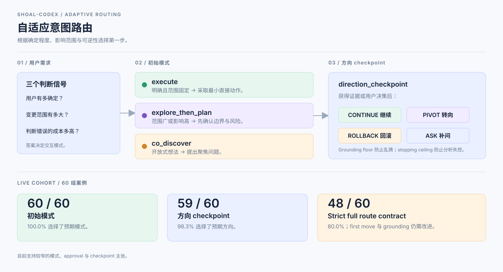

# shoal-codex

> Codex 原生的 orchestration layer，根据需求的明确程度与风险，选择合适的
> 第一步：直接执行、探索后规划，或共同澄清。

[English](../hosts/codex/README.md) · [繁體中文](./README.zh-TW.md)

Shoal-Codex 是受
[Nanako0129/pilotfish](https://github.com/Nanako0129/pilotfish) 启发的独立 Codex CLI
版本。它整合 typed agent roles、明确的 approval boundaries、adaptive intent
routing，以及使用 fresh context 的 outcome verification。



## 项目做什么

第一步取决于用户的确定程度、变更规模，以及判断错误的成本：

| 需求情况 | 初始模式 | 第一个动作 |
| --- | --- | --- |
| 明确且范围固定 | `execute` | 确认目标与 approval，再采取最小的直接动作。 |
| 范围广或影响高 | `explore_then_plan` | 先确认边界、整理风险，再提出可逆的切片。 |
| 还没有明确边界的想法 | `co_discover` | 提出聚焦问题，定义最小可行的实验。 |

Policy 同时设置 grounding floor，避免资料不足时乱猜；设置 stopping
ceiling，避免分析无限扩张；并使用 `direction_checkpoint` 判断应该继续、转向、
回滚，或向用户补问。

## 从意图到 role

Intent routing 决定交互形状；上游 Nanako0129/pilotfish 的 role system 再把工作分配给
各自边界明确的角色。一个需求不需要经过全部 role。

| 路径 | 常见 role path | 作用 |
| --- | --- | --- |
| `execute` | `executor` 或 `mech-executor` → approval gate → 有风险时再 `verifier` | 实现明确且范围固定的结果，并在 authority gate 前停下。 |
| `explore_then_plan` | `scout` → Plan → 需要 review 时 `plan-verifier` → `executor` 或 `mech-executor` → `verifier` | 先确认边界、审查切片，再实现与验证。 |
| `co_discover` | Root session + 有界的 `scout` → `execute` 或 `explore_then_plan` | 把想法整理成稳定的问题、目标、MVP 与 acceptance boundary。 |
| Security-sensitive work | `security-reviewer` → approved Plan → `security-executor` → `verifier` | 将 security evidence 与 implementation 保持在不同 capability boundary。 |

当前安装的八个 role：

| Role | 职责 |
| --- | --- |
| `scout` | Read-only repository reconnaissance。 |
| `plan-verifier` | 在 approval 前挑战 material Plan。 |
| `executor` | 需要 engineering judgment 的有界实现。 |
| `mech-executor` | 已完整规格化的 mechanical implementation。 |
| `sol-executor` | 使用一般 engineering judgment 的有界实现。 |
| `security-reviewer` | approval 前的 read-only security evidence。 |
| `security-executor` | 已批准的 security-sensitive implementation。 |
| `verifier` | 使用 fresh context 验证 outcome 或 direction checkpoint。 |

Root session 负责 routing、Plan synthesis、approval decision、integration 与
finding disposition。完整的 delegation 与 verification 规则请查看
[docs/design.md](./design.md)。

## 为什么这样拆 role

这些 role 将直接执行与高不确定性的 review 分开。v6 benchmark 使用固定的
artifact task 作为 native-rollout proxy：


既有 v6 benchmark 早于 GPT-6 role binding，不代表 GPT-6 的质量或延迟比较结果。
当前 policy 让 Luna 处理 atomic／mechanical 工作，Sol 处理一般判断、设计与 QA，
只有深层架构或冲突证据才使用 Astra。root session 不会自动切换模型。这是 routing
decision，不是通用的 intelligence ranking。历史 benchmark 与 bar charts 请查看
[usage-routing benchmark](./benchmarks/usage-routing-v1/README.md)。

## Opt-in Astra 主工作阶段

如果用户明确选择 Astra 作为 root session，可以用 launch-time override 启动
一个 zero-write、只限该 session 的模式：

`<strong-model>` 是 Codex binding 为 strong tier 解析出的模型，
可用 `python3 tools/render.py --host codex --explain` 查看。

```bash
codex --model <strong-model> \
  -c model_reasoning_effort="high" \
  -c plan_mode_reasoning_effort="high" \
  -c agents.max_concurrent_threads_per_session=1
```

`astra-thinking` 让 Astra 负责 synthesis、planning 与难判断；mechanical 和
重复工作交给 Luna；一般判断与验证使用 Sol，只有 deep boundary 才使用 Astra。
`max_tool_calls=12` 与 `max_wall_seconds=300` 是 advisory
限制，不是 provider quota；既有 approval 与
security gates 不变。Astra 不可用或 override 无效时会在 task work 前
fail-closed；移除 flags 后另开新 session 即回到正常 Luna/Sol policy。

## 实验效果

正式 live cohort 使用三个代表性场景，共 60 组案例；每组各执行一次 route
call 与 checkpoint call，使用可解析版本的 Codex CLI；实际版本会记录在
receipt，native contract 由 runtime evidence 验证。

| 指标 | 结果 | 解读 |
| --- | ---: | --- |
| 初始模式 routing | 60 / 60（100.0%） | 三种交互模式都选择正确。 |
| 必要 approval boundary | 60 / 60（100.0%） | 没有漏掉必要的 approval gate。 |
| Direction checkpoint | 59 / 60（98.3%） | 几乎每次都选择正确的下一步方向。 |
| Strict full route contract | 48 / 60（80.0%） | First move 与 grounding 的合并主张尚未达标。 |

这些结果支持较窄的“模式选择、approval 与 checkpoint”主张，不代表每个
response 都完美。Strict misses 与完整分析保留在
[实验结果](./specs/adaptive-intent-routing/EXPERIMENT-RESULTS.md) 中追踪。

## 快速安装

要求：可解析版本的 Codex CLI、Python `3.11+`、Bash，以及本地 checkout。

先执行 dry-run。它只会规划变更，不会写入 Codex home：

```bash
bash install/install.sh --dry-run --codex-home "$ACTIVE_CODEX_HOME"
```

确认要写入的路径并批准 home write 后，再执行：

```bash
bash install/install.sh --codex-home "$ACTIVE_CODEX_HOME"
```

在原生 Windows 上，请从 PowerShell 使用 Python entrypoint，因为
`install/install.sh` 是 Bash wrapper：

```powershell
$codexHome = if ($env:CODEX_HOME) { $env:CODEX_HOME } else { Join-Path $HOME ".codex" }
py -3 install/install.py --dry-run --codex-home $codexHome
py -3 install/install.py --codex-home $codexHome
```

Installer 会加入 native seven-role manifest 与 shoal routing hook。安装后
请在新的交互式 Codex session 中 trust 这个 hook。

Remote installation 必须在 script URL 与 archive ref 使用同一个 release tag
或完整 commit SHA。不要从可变动的 `main` 安装到真实 Codex home。

完整的 approval、migration、backup、recovery 与 trust 步骤请查看
[INSTALL.md](../INSTALL.md)、[install/AGENT-INSTALL.md](../install/AGENT-INSTALL.md)
以及可复用的 [INSTALL_PROMPT.md](../INSTALL_PROMPT.md)。

## 文档导航

| 主题 | 文档 |
| --- | --- |
| Design 与 policy 边界 | [docs/design.md](./design.md) |
| Adaptive routing 设计 | [EXPERIMENT.md](./specs/adaptive-intent-routing/EXPERIMENT.md) |
| Adaptive routing 结果 | [EXPERIMENT-RESULTS.md](./specs/adaptive-intent-routing/EXPERIMENT-RESULTS.md) |
| Live experiment protocol | [LIVE-EXPERIMENT.md](./specs/adaptive-intent-routing/LIVE-EXPERIMENT.md) |
| Usage-routing benchmark | [benchmark README](./benchmarks/usage-routing-v1/README.md) |
| Native verification | [verification README](./verification/README.md) |

## 本地验证

```bash
bun install --frozen-lockfile
bun run lint:md
python3 -m unittest discover -s tests -v
```

## License

MIT。保留上游 Nanako0129/pilotfish 的 attribution 与 permission notice。
