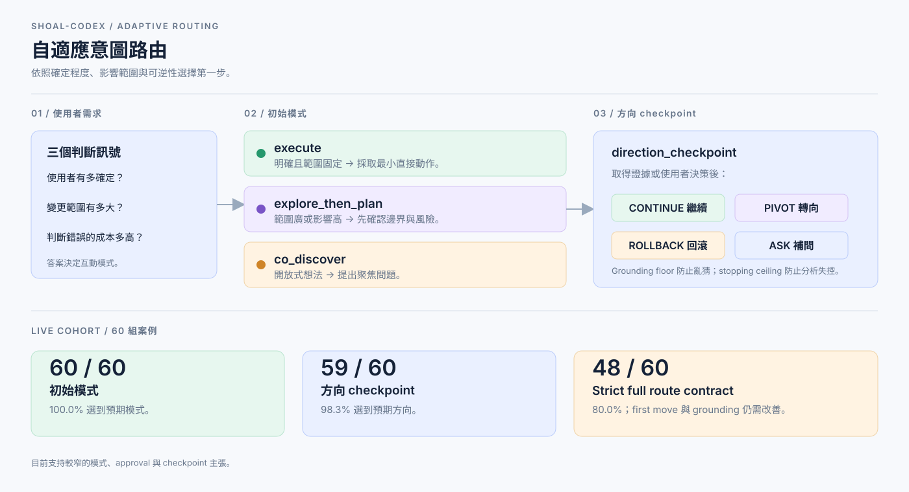

# shoal-codex

> Codex 原生的 orchestration layer，依照需求的明確程度與風險，選擇合適
> 的第一步：直接執行、探索後規劃，或共同釐清。

[English](../hosts/codex/README.md) · [简体中文](./README.zh-CN.md)

Shoal-Codex 是受
[Nanako0129/pilotfish](https://github.com/Nanako0129/pilotfish) 啟發的獨立 Codex CLI
版本。它整合 typed agent roles、明確的 approval boundaries、adaptive intent
routing，以及使用 fresh context 的 outcome verification。



## 專案做什麼

第一步取決於使用者的確定程度、變更規模，以及判斷錯誤的成本：

| 需求情況 | 初始模式 | 第一個動作 |
| --- | --- | --- |
| 明確且範圍固定 | `execute` | 確認目標與 approval，再採取最小的直接動作。 |
| 範圍廣或影響高 | `explore_then_plan` | 先確認邊界、整理風險，再提出可逆的切片。 |
| 還沒有明確邊界的想法 | `co_discover` | 提出聚焦問題，定義最小可行的實驗。 |

Policy 同時設定 grounding floor，避免在資料不足時亂猜；設定 stopping
ceiling，避免分析無限擴張；並用 `direction_checkpoint` 判斷應該繼續、轉向、
回滾，或向使用者補問。

1.6.0 另外支援目前 turn 的明確 review intent：`fast` 省略 optional review
overhead、`default` 依照既有 risk policy、`strict` 擴大 review 與 verification。
這個 signal 不會覆寫必要的 approval 或 safety gate；Matrix 與「品質兼顧的成本
效益」指標請見 [1.6.0 spec](./specs/intent-aware-review-routing-1-6-0/SPEC.md)。

## 從意圖到 role

Intent routing 決定互動形狀；上游 Nanako0129/pilotfish 的 role system 再把工作分配給
各自有明確邊界的角色。一個需求不需要經過全部 role。

| 路徑 | 常見 role path | 作用 |
| --- | --- | --- |
| `execute` | `executor` 或 `mech-executor` → approval gate → 有風險時再 `verifier` | 實作明確且範圍固定的結果，並在 authority gate 前停下。 |
| `explore_then_plan` | `scout` → Plan → 需要 review 時 `plan-verifier` → `executor` 或 `mech-executor` → `verifier` | 先確認邊界、審查切片，再實作與驗證。 |
| `co_discover` | Root session + 有界的 `scout` → `execute` 或 `explore_then_plan` | 把想法整理成穩定的問題、目標、MVP 與 acceptance boundary。 |
| Security-sensitive work | `security-reviewer` → approved Plan → `security-executor` → `verifier` | 將 security evidence 與 implementation 保持在不同 capability boundary。 |

目前安裝的八個 role：

| Role | 職責 |
| --- | --- |
| `scout` | Read-only repository reconnaissance。 |
| `plan-verifier` | 在 approval 前挑戰 material Plan。 |
| `executor` | 需要 engineering judgment 的有界實作。 |
| `mech-executor` | 已完整規格化的 mechanical implementation。 |
| `sol-executor` | 使用一般 engineering judgment 的有界實作。 |
| `security-reviewer` | approval 前的 read-only security evidence。 |
| `security-executor` | 已核准的 security-sensitive implementation。 |
| `verifier` | 使用 fresh context 驗證 outcome 或 direction checkpoint。 |

Root session 負責 routing、Plan synthesis、approval decision、integration 與
finding disposition。完整的 delegation 與 verification 規則請看
[docs/design.md](./design.md)。

## 為什麼這樣拆 role

這些 role 將直接執行與高不確定性的 review 分開。v6 benchmark 使用固定的
artifact task 作為 native-rollout proxy：


既有 v6 benchmark 早於 GPT-6 role binding，不代表 GPT-6 的品質或延遲比較結果。
目前的 policy 讓 Luna 處理 atomic／mechanical 工作，Sol 處理一般判斷、設計與 QA，
只有深層架構或衝突證據才使用 Astra。Root session 不會自動切換模型。這是 routing
decision，不是通用的 intelligence ranking。歷史 benchmark 與 bar charts 請看
[usage-routing benchmark](./benchmarks/usage-routing-v1/README.md)。

## Opt-in Astra 主工作階段

如果使用者明確選擇 Astra 作為 root session，可以用 launch-time override
啟動一個 zero-write、只限該 session 的模式：

`<strong-model>` 是 Codex binding 為 strong tier 解析出的模型，
可用 `python3 tools/render.py --host codex --explain` 查看。

```bash
codex --model <strong-model> \
  -c model_reasoning_effort="high" \
  -c plan_mode_reasoning_effort="high" \
  -c agents.max_concurrent_threads_per_session=1
```

`astra-thinking` 讓 Astra 負責 synthesis、planning 與難判斷；mechanical 和
重複工作交給 Luna；一般判斷與驗證使用 Sol，只有 deep boundary 才使用 Astra。
`max_tool_calls=12` 與 `max_wall_seconds=300` 是 advisory
限制，不是 provider quota；既有 approval 與
security gates 不變。Astra 不可用或 override 無效時會在 task work 前
fail-closed；移除 flags 後另開新 session 即回到正常 Luna/Sol policy。

## 實驗效果

正式 live cohort 使用三個代表性情境，共 60 組案例；每組各執行一次 route
call 與 checkpoint call，使用可解析版本的 Codex CLI；實際版本會記錄在
receipt，native contract 由 runtime evidence 驗證。

| 指標 | 結果 | 解讀 |
| --- | ---: | --- |
| 初始模式 routing | 60 / 60（100.0%） | 三種互動模式都選對。 |
| 必要 approval boundary | 60 / 60（100.0%） | 沒有漏掉必要的 approval gate。 |
| Direction checkpoint | 59 / 60（98.3%） | 幾乎每次都選對下一步方向。 |
| Strict full route contract | 48 / 60（80.0%） | First move 與 grounding 的合併主張尚未達標。 |

這些結果支持較窄的「模式選擇、approval 與 checkpoint」主張，不代表每個
response 都完美。Strict misses 與完整分析留在
[實驗結果](./specs/adaptive-intent-routing/EXPERIMENT-RESULTS.md) 中追蹤。

## 快速安裝

需求：可解析版本的 Codex CLI、Python `3.11+`、Bash，以及本地 checkout。

先執行 dry-run。它只會規劃變更，不會寫入 Codex home：

```bash
bash install/install.sh --dry-run --codex-home "$ACTIVE_CODEX_HOME"
```

確認要寫入的路徑並核准 home write 後，再執行：

```bash
bash install/install.sh --codex-home "$ACTIVE_CODEX_HOME"
```

在原生 Windows 上，請從 PowerShell 使用 Python entrypoint，因為
`install/install.sh` 是 Bash wrapper：

```powershell
$codexHome = if ($env:CODEX_HOME) { $env:CODEX_HOME } else { Join-Path $HOME ".codex" }
py -3 install/install.py --dry-run --codex-home $codexHome
py -3 install/install.py --codex-home $codexHome
```

Installer 會加入 native seven-role manifest 與 shoal routing hook。安裝
後請在新的互動式 Codex session 中 trust 這個 hook。

Remote installation 必須在 script URL 與 archive ref 使用同一個 release tag
或完整 commit SHA。不要從可變動的 `main` 安裝到真實 Codex home。

完整的 approval、migration、backup、recovery 與 trust 步驟請看
[INSTALL.md](../INSTALL.md)、[install/AGENT-INSTALL.md](../install/AGENT-INSTALL.md)
與可重用的 [INSTALL_PROMPT.md](../INSTALL_PROMPT.md)。

## 文件導覽

| 主題 | 文件 |
| --- | --- |
| Design 與 policy 邊界 | [docs/design.md](./design.md) |
| Prompt／description 文件鎖 | [lock spec](./specs/prompt-document-lock/SPEC.md) |
| Adaptive routing 設計 | [EXPERIMENT.md](./specs/adaptive-intent-routing/EXPERIMENT.md) |
| Adaptive routing 結果 | [EXPERIMENT-RESULTS.md](./specs/adaptive-intent-routing/EXPERIMENT-RESULTS.md) |
| Live experiment protocol | [LIVE-EXPERIMENT.md](./specs/adaptive-intent-routing/LIVE-EXPERIMENT.md) |
| Usage-routing benchmark | [benchmark README](./benchmarks/usage-routing-v1/README.md) |
| Native verification | [verification README](./verification/README.md) |

## 本地驗證

```bash
bun install --frozen-lockfile
bun run lint:md
python3 install/validate_prompt_lock.py --base-ref HEAD
python3 -m unittest discover -s tests -v
```

## License

MIT。保留上游 Nanako0129/pilotfish 的 attribution 與 permission notice。
