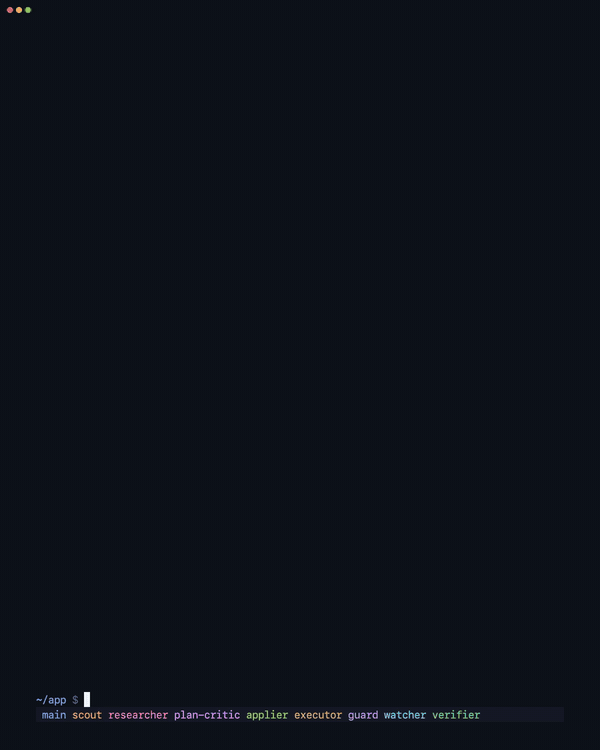
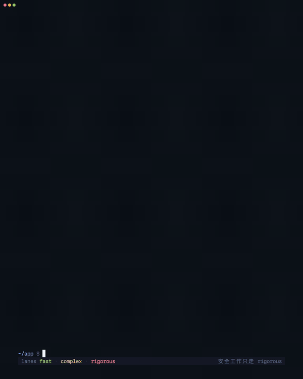
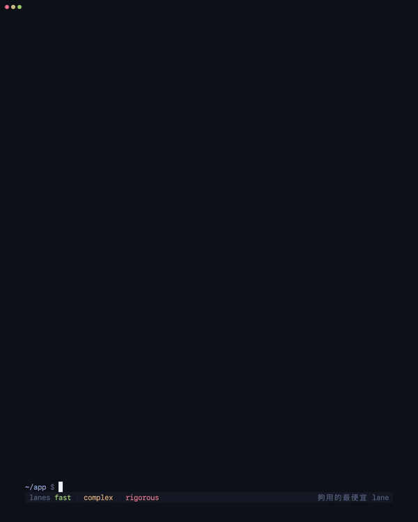

<!-- markdownlint-disable MD013 -->
# shoal

只需定義一次 agent role，shoal 就能依照各廠牌 agent 配好模型、權限與 prompt，自動 orchestration；毋需撰寫任何程式。

[English](../README.md) · 繁體中文 · [简体中文](./README.zh-CN.md)

## 適用場景

- 定義一份 role，讓五種以上的 agent host 各自拿到合適的模型、權限和 prompt進行工作。
- 主 session 負責判斷與整合，改檔和長指令派給對應的 role。
- 派工規則由 guard 於各個 host 強制執行，不靠模型自覺。
- 要支援新工具，僅需填寫設定即可，不需撰寫程式。

## 運作方式


role 寫在 core，每個 host 用 binding 說明自己的模型與權限，再由 `render.py` 產出安裝檔。


role 只寫 tier，不寫模型名稱；每個 host 從自己的模型目錄挑出符合的那一個。


主 session 先看工作的形狀和風險，再決定自己做、派給哪個 role，或走完整的審查流程。


主 session 沒派可寫 role 就改檔，或 subagent 不是 shoal 的可寫 role 卻改檔，都會被擋；出口是改派可寫的 role，或在 prompt 加 `#direct`。

## 運作示範

### 大型跨 module 改動

大型改動先拆成 spec，再由主 session 派給各 role 分頭處理。



[mp4](./assets/reel-big-change/out/scene.mp4)

### 資安敏感改動走嚴謹路線

涉及 auth、secret 或權限的改動，先審 Plan 再派 security role 執行。



[mp4](./assets/reel-security/out/scene.mp4)

### 派工 lane 與 guard

每條派工 lane 有明確的 role 與權限，guard 在越界時擋下。



[mp4](./assets/reel-lanes/out/scene.mp4)

English: [big change](./assets/reel-big-change/out-en/scene.mp4) · [security path](./assets/reel-security/out-en/scene.mp4)

## 快速開始

shoal 目前是 beta：beta 的 minor 版本可能有破壞性變更，正式版從 1.0.0 開始（[版本 channel](./reference.md#版本-channel)）。

```bash
# 先看會做什麼（dry-run，不寫入）
python3 tools/shoal_install.py --host codex
# 安裝：--host 可換成 claude、codex、grok、opencode、agy
python3 tools/shoal_install.py --host codex --apply
```

只靠 `python3`（stdlib）。支援 macOS 與 Linux，Windows 為實驗性支援。不帶 `--apply` 是 dry-run，會顯示底層 installer 的預覽；`claude`、`codex`、`bun` 這類外部 CLI 找不到時，dry-run 回報 `skipped`。opencode 需要 `bun` 才能 `--apply`。

Claude Code 另有 plugin marketplace 的替代方式（裝最新穩定版）：

```bash
claude plugin marketplace add miyago9267/shoal
claude plugin install shoal@shoal
```

每個 host 的細節與不用 plugin 的 Claude Code 見 [INSTALL.md](../INSTALL.md)。

## 模組

只裝需要的部分：`python3 tools/shoal_install.py --host <h>` 預設只印出會執行的指令，加 `--apply` 才安裝。

不要派工守門就加 `--without dispatch-guard`，`--list` 列出模組與已安裝狀態。

外部 guard 經 guard chain 接入：`--chain-add` 登記，不需要改 shoal。

細節見 [INSTALL.md 的模組](../INSTALL.md#模組)。

## 支援的 host

| Host | 安裝方式 | guard |
| --- | --- | --- |
| Claude Code | plugin，或 `tools/install_hooks.py` | hook，預設擋 |
| Codex CLI | `install/install.sh` | hook，需在 `/hooks` 核准一次 |
| Gemini/agy | `hosts/agy/dist` 加 `tools/install_hooks.py` | hook，預設擋，沒有 `#direct` |
| Grok Build | `tools/install_grok.py` | 原生 hooks |
| OpenCode | `install.sh --enable` | plugin 內建 |

## 快速與嚴謹

預設走快速路徑：讀檔、診斷和整合由主 session 直接做，改檔派給可寫的 role。遇到風險或大型工作才走嚴謹路徑：計畫審查、核准，完成後再驗證。想讓主 session 自己改檔，可在 prompt 加 `#direct`。若要整個 session 都走快，可在 prompt 加 `#fast`：主 session 可以直接改檔，硬規則（role 不再派工、審查 role 不改檔）和結束前的檢查照舊。可用 `#strict` 關閉；沒有 prompt 文字的工具（agy）則設 `SHOAL_GUARD_FAST=1`。

## 和 pilotfish 的關係

shoal 衍生自 [Nanako0129/pilotfish](https://github.com/Nanako0129/pilotfish)，Claude 端以 pilotfish v1.4.2 為分岔基準。pilotfish 目前是 v1.5.0（2026-10-10），是 Claude Code 的多模型 orchestration policy，Plugin 已脫離 beta；其他工具各有姊妹專案（pilotfish-grok、pilotfish-codex、remora）。

| 面向 | pilotfish | shoal |
| --- | --- | --- |
| 支援範圍 | Claude Code 為主，其他工具各一個專案 | 一份 role 定義 render 成 5 個 host |
| 派工判斷 | main 依淨效益判斷，小而局部的工作自己做 | 改檔一律交給可寫 role（`#direct` 例外） |
| 強制範圍 | hook 只擋硬規則（leaf 不再派工、verifier 不改檔） | 另擋 main 直接改檔、非 shoal agent 改檔、role 未啟動、改完沒檢查就結束 |
| 證據 | 每個決定都附 benchmark 與量測 | 以 payload 擷取與各 host 實測為主，量測較少 |

shoal 並不平替 pilotfish，亦非上位版本：策略為將 role 與條款擴到多個廠牌並加上強制執行，代價是較重且較嚴格。若只用 Claude Code、想要輕量且有量測支撐的 policy，用 [pilotfish](https://github.com/Nanako0129/pilotfish)即可；要是同時使用多個 agent 工具、想要一份定義和一致的強制規則，用 shoal 會更符合您的工作流。

## 延伸閱讀

- [INSTALL.md](../INSTALL.md)：完整安裝、guard 規則與環境變數。
- [docs/DESIGN-INVARIANTS.md](./DESIGN-INVARIANTS.md)：不能改的設計原則。
- [docs/new-host.md](./new-host.md)：新增 host 的步驟。
- [CHANGELOG.md](../CHANGELOG.md)：版本紀錄。

## 來源與致謝

shoal 衍生自 [Nanako0129/pilotfish](https://github.com/Nanako0129/pilotfish)。grok host 的 orchestration rules 與 agent 原文取自 [Nanako0129/pilotfish-grok](https://github.com/Nanako0129/pilotfish-grok) v1.0.6，shoal 加上 core 條款、原生 hooks 與 installer；`upstream.lock` 記錄版本。codex host 原本是 `miyago9267/pilotfish-codex`，v1.0.0 起併入本 repo；v1.0.0 之前的 pinned ref 仍在 [pilotfish-codex](https://github.com/miyago9267/pilotfish-codex)。上游 Pilotfish 的著作權與授權聲明沿用，見 `LICENSE`。
