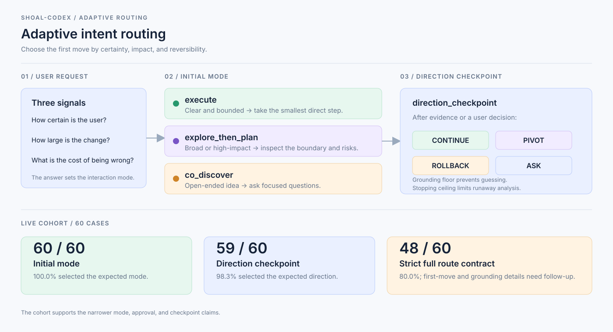

# pilotfish-codex

> A Codex-native orchestration layer that chooses a realistic first move for
> clear work, broad changes, and open-ended ideas.

[繁體中文](../../docs/README.zh-TW.md) · [简体中文](../../docs/README.zh-CN.md)

Pilotfish-Codex is an independent Codex CLI adaptation inspired by
[Pilotfish](https://github.com/Nanako0129/pilotfish). It combines typed agent
roles, explicit approval boundaries, adaptive intent routing, and
fresh-context outcome verification.



## What it does

The first move follows the user's certainty, the size of the change, and the
cost of being wrong:

| Request shape | Initial mode | First move |
| --- | --- | --- |
| Clear and bounded | `execute` | Confirm the target and approval, then take the smallest direct step. |
| Broad or high-impact | `explore_then_plan` | Establish the boundary, surface risks, and propose a reversible slice. |
| Open-ended idea | `co_discover` | Ask focused questions and define the smallest useful experiment. |

The policy also applies a grounding floor to prevent unsupported guessing, a
stopping ceiling to prevent runaway analysis, and a `direction_checkpoint` to
decide whether to continue, pivot, roll back, or ask for more input.

In v1.6.0, an explicit current-turn request can also choose review intent:
`fast` skips optional review overhead, `default` follows the risk policy, and
`strict` expands review and verification. This signal never overrides required
approval or safety gates. The offline Matrix and quality-adjusted cost metric
are documented in the [1.6.0 spec](../../docs/specs/intent-aware-review-routing-1-6-0/SPEC.md).

## From intent to roles

Intent routing chooses the interaction shape. The original Pilotfish role
system then assigns bounded responsibilities inside that shape; a request does
not need every role.

| Route | Typical role path | Purpose |
| --- | --- | --- |
| `execute` | `executor` or `mech-executor` → approval gate → `verifier` when risk-triggered | Implement a clear, bounded outcome and stop before an authority gate. |
| `explore_then_plan` | `scout` → Plan → `plan-verifier` when review is required → `executor` or `mech-executor` → `verifier` | Establish the boundary, review the slice, then implement and verify it. |
| `co_discover` | Root session + bounded `scout` → `execute` or `explore_then_plan` | Turn an idea into a stable problem, target, MVP, and acceptance boundary. |
| Security-sensitive work | `security-reviewer` → approved Plan → `security-executor` → `verifier` | Keep security evidence and implementation on separate capability boundaries. |

The eight installed roles are:

| Role | Responsibility |
| --- | --- |
| `scout` | Read-only repository reconnaissance. |
| `plan-verifier` | Pre-approval challenge of a material Plan. |
| `executor` | Bounded implementation requiring engineering judgment. |
| `mech-executor` | Fully specified mechanical implementation. |
| `sol-executor` | Bounded implementation using ordinary engineering judgment. |
| `security-reviewer` | Read-only security evidence before approval. |
| `security-executor` | Approved security-sensitive implementation. |
| `verifier` | Fresh-context outcome or direction-checkpoint verification. |

The root session owns routing, Plan synthesis, approval decisions, integration,
and finding disposition. Full delegation and verification rules are in
[docs/design.md](../../docs/design.md).

## Why this role split

The roles separate direct execution from high-uncertainty review. The v6
benchmark used a fixed artifact task as a native-rollout proxy:


The archived v6 benchmark predates the GPT-6 role bindings and is not a
comparative quality or latency result for GPT-6. The current policy uses Luna
for atomic and mechanical work, Sol for routine judgment, design, and QA, and
Astra only for deep architecture or conflicting evidence. The root session
does not switch models automatically. This is a routing decision, not a
general intelligence ranking. The historical benchmark and charts are in the
[usage-routing benchmark](../../docs/benchmarks/usage-routing-v1/README.md).

## Opt-in Astra main-session mode

Users who deliberately choose Astra for the root session can keep the
expensive model focused on synthesis, planning, and difficult judgment while
Pilotfish sends mechanical work to the existing Luna roles. Start a separate
session with launch-time overrides:

```bash
codex --model gpt-6-astra \
  -c model_reasoning_effort="high" \
  -c plan_mode_reasoning_effort="high" \
  -c agents.max_concurrent_threads_per_session=1
```

The overrides are zero-write and session-only; the installed root Luna/Plan,
Sol review config, roles, hooks, and approval boundaries remain unchanged. The
prompt recommends named inputs, one sufficient pass, and stopping at
acceptance evidence. Its
`max_tool_calls=12` and `max_wall_seconds=300` limits are advisory, not a
provider-enforced quota. `mech-executor` and `scout` stay on Luna, normal
judgment and verification use Sol, and `executor` uses Astra only at the deep
boundary. If Astra is unavailable or an override is
invalid, activation fails closed before task work; start a new session without
the flags to return to the normal policy.

## Evidence

The registered live cohort used 60 cases from the three representative
scenarios, with one route call and one checkpoint call per case using Codex CLI
`0.147.0`.

| Signal | Result | Interpretation |
| --- | ---: | --- |
| Initial mode routing | 60 / 60 (100.0%) | The three interaction modes were selected correctly. |
| Required approval boundary | 60 / 60 (100.0%) | No required approval gate was lost. |
| Direction checkpoint | 59 / 60 (98.3%) | The next-direction decision was selected correctly in almost every case. |
| Strict full route contract | 48 / 60 (80.0%) | The combined first-move and grounding claim is not yet supported. |

These results support the narrower mode, approval, and checkpoint claims. They
are evidence for routing behavior, not a claim that every response is perfect.
The strict misses remain documented for follow-up.

## Install quickly

Prerequisites: Codex CLI `>=0.147.0` (later releases are accepted), Python
`3.11+`, and a local checkout. Use Bash on POSIX systems or PowerShell on
native Windows.

Run a dry-run first. It plans the changes without writing to the Codex home:

```bash
bash install/install.sh --dry-run --codex-home "$ACTIVE_CODEX_HOME"
```

After reviewing the planned paths and approving the home write, run:

```bash
bash install/install.sh --codex-home "$ACTIVE_CODEX_HOME"
```

On native Windows, use the PowerShell wrapper; it delegates to the same
`install.py` backend used on every OS:

```powershell
$codexHome = if ($env:CODEX_HOME) { $env:CODEX_HOME } else { Join-Path $HOME ".codex" }
.\install\install.ps1 --dry-run --codex-home $codexHome
.\install\install.ps1 --codex-home $codexHome
```

The installer preserves valid user-owned roles outside Pilotfish's seven names.
If a Pilotfish role has the same name as a customized user role, the install
stops for explicit resolution. Add `--replace-drifted-role <role>` to both
commands only after choosing the Pilotfish role; repeat the option for multiple
roles. Use `--replace-drifted-roles` only when all same-name drifted roles are
intentionally being aligned. Role validation and post-install fingerprint
verification remain enabled.

The current policy and config remain the source of truth. If a committed state
is stale because the current policy was edited, preview and explicitly opt in
to reconciliation; the installer preserves the current bytes and publishes
state-version-4 provenance:

```bash
bash install/install.sh --dry-run --reconcile-current --codex-home "$ACTIVE_CODEX_HOME"
bash install/install.sh --reconcile-current --codex-home "$ACTIVE_CODEX_HOME"
```

For a dotfiles-managed policy symlink, also pass its contained canonical root:
`--follow-policy-symlink --policy-root "$HOME/dotfile/config/ai"`. An installed
Pilotfish Plugin newer than this checkout stops unless
`--allow-plugin-downgrade` is explicitly selected.

The installer adds the native Pilotfish role manifest and routing hook,
integrates a short always-on bootstrap into the active root `AGENTS.md`, and
installs the full `pilotfish-orchestration` workflow through Codex's supported
local marketplace/Plugin mechanism while preserving user content outside the
managed marker block. Symlinked or
hard-linked policy files require explicit resolution. Trust the hook in a new
interactive Codex session after installation.
On Windows, it also warns about preserved command hooks that lack
`commandWindows`; those hooks are not modified automatically.

For remote installation, pin the same release tag or full commit SHA in the
script URL and archive ref. Do not install a real Codex home from mutable
`main`.

Detailed approval, migration, backup, recovery, and trust steps are in
[INSTALL.md](../../INSTALL.md) and
[install/AGENT-INSTALL.md](../../install/AGENT-INSTALL.md). The reusable agent
prompt is in [INSTALL_PROMPT.md](../../INSTALL_PROMPT.md).

## Documentation

| Topic | Document |
| --- | --- |
| Design and policy boundaries | [docs/design.md](../../docs/design.md) |
| Prompt/document lock | [lock spec](../../docs/specs/prompt-document-lock/SPEC.md) |
| Adaptive routing design | [EXPERIMENT.md](../../docs/specs/adaptive-intent-routing/EXPERIMENT.md) |
| Adaptive routing results | [EXPERIMENT-RESULTS.md](../../docs/specs/adaptive-intent-routing/EXPERIMENT-RESULTS.md) |
| Live experiment protocol | [LIVE-EXPERIMENT.md](../../docs/specs/adaptive-intent-routing/LIVE-EXPERIMENT.md) |
| 1.6.0 intent runtime and live evidence | [intent-aware spec](../../docs/specs/intent-aware-review-routing-1-6-0/SPEC.md) |
| Usage-routing benchmark | [benchmark README](../../docs/benchmarks/usage-routing-v1/README.md) |
| Native verification | [verification README](../../docs/verification/README.md) |
| Traditional Chinese entry | [docs/README.zh-TW.md](../../docs/README.zh-TW.md) |
| Simplified Chinese entry | [docs/README.zh-CN.md](../../docs/README.zh-CN.md) |

## Local verification

```bash
bun install --frozen-lockfile
bun run lint:md
python3 install/validate_prompt_lock.py --base-ref HEAD
python3 -m unittest discover -s tests -v
```

MIT. The original Pilotfish attribution and permission notice are retained.
